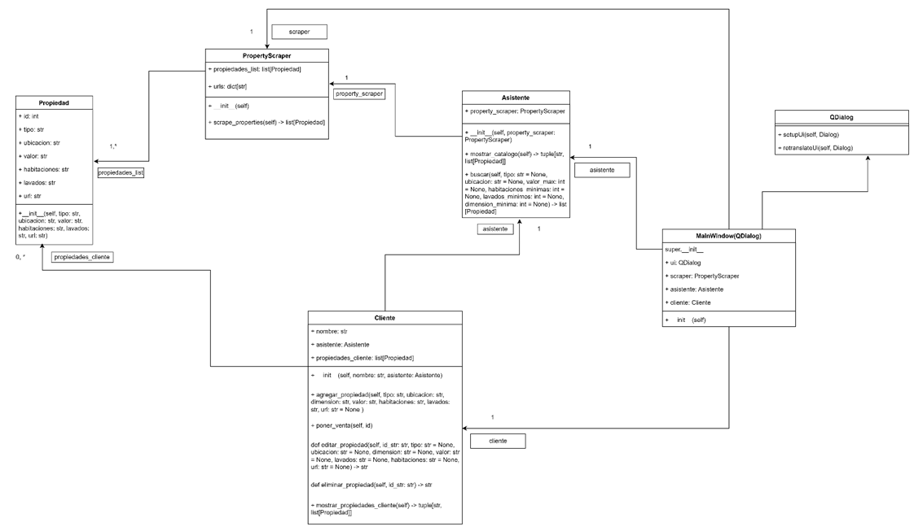

# Asistente Inmobiliario Inteligente

Este proyecto consiste en el desarrollo de un Asistente Inmobiliario Inteligente para una agencia inmobiliaria. El asistente tiene como objetivo principal recolectar datos de propiedades y facilitar la interacción con clientes interesados en comprar propiedades.

## Funcionalidades Principales

- Extracción de datos de propiedades de MercadoLibre Colombia utilizando web scraping.
- Búsqueda de propiedades basada en criterios específicos como tipo, ubicación, valor máximo, cantidad mínima de habitaciones, cantidad mínima de baños y dimensión mínima.
- Agregar nuevas propiedades para la venta.
- Mostrar un catálogo de propiedades disponibles.

## Notas

- Este es un primer prototipo del asistente inmobiliario. En futuras versiones, se tiene contemplado integrar la API de MercadoLibre para obtener datos de propiedades de manera más eficiente y fiable.
- También se considera desarrollar una interfaz gráfica utilizando el framework Django de Python para mejorar la experiencia del usuario.

### Emmanuel Calad Correa